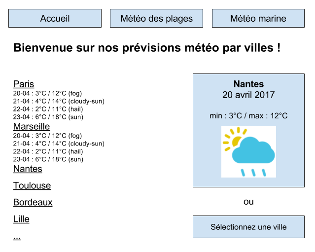

# Prévisions météo

## Objectif
Créer une page de prévisions météo, ainsi qu'un "widget" qui affichera en permanence la prévision météo d'une ville sur différentes pages.

On utilisera nos connaissances en Controller/Routes, Modèle PHP, Twig, Session.

### Préambule

- CSS : aucune, _à la mano_, framework CSS de votre choix.
- Variantes de l'énoncé : acceptées (vous pouvez faire évoluer l'énoncé tant que vous respectez l'objectif).

### Etapes

- **Afficher la liste** des villes
    - en mode texte, **afficher toutes les prévisions** des jours à venir
    - _Indice : il y aura certainement des **boucles imbriquées** ici, vu que les données contiennent des tableaux imbriqués._
- Sélectionner une ville pour **mettre cette ville dans le widget**.
    - **afficher un flashMessage** qui indique que la ville a été sélectionnée pour le widget.
- **Créer un _partial_** pour le widget météo :
    - **inclure ce partial** dans les templates des pages
    - **afficher les prévisions météos** (ville, date, température min/max, image météo), **de la ville choisie**
    - **sinon afficher un lien** pour choisir une ville
    - **inclure le sprite css des icônes météo (classe `meteo` + prévision)** pour afficher les images correspondant à la prévision du jour. Penser à utiliser la propriété CSS `zoom` afin de réduire le sprite en cas de besoin.

**Exemples de pages (lorem ipsum...) à créer pour afficher le widget :**

- Accueil (affiche la liste des villes).
- Météo des plages.
- Météo marine.
- Carte satellite.

=> Modifier ou créer le menu principal pour inclure ces pages.

### Modèle fourni

Le modèle fourni (dans dossier `data/WeatherModel.php`) contient déjà des données (array) et vous propose 2 méthodes statiques pour les récupérer :

**Toutes les villes**

`$data = WeatherModel::getWeatherData();`

**Les données pour une ville**

Pour la ville en index numéro 5 :

`$city = WeatherModel::getWeatherByCityIndex(5);`

_A noter que les données sont écrites à la fin du modèle pour plus de lisibilité des méthodes fournies. La bonne pratique étant d'écrire les propriétés avant les méthodes, c'est volontaire ici._
